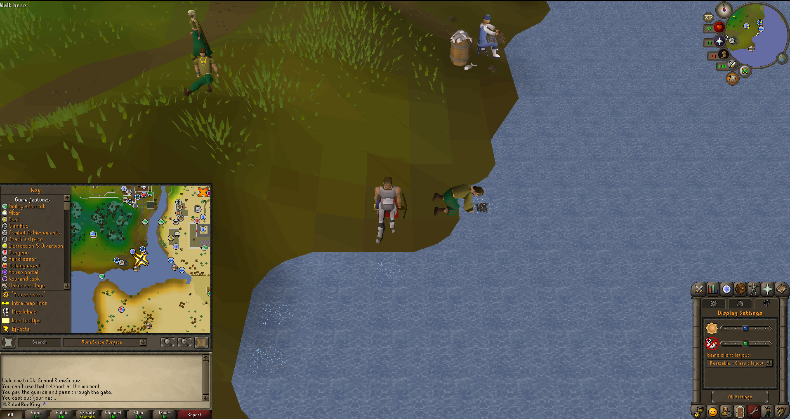

# RobotJS - OSRS Shrimp Bot 🦐

This repository uses [Robot.js](https://robotjs.io/) to automate mouse and keyboard inputs ( [Node.js](https://nodejs.org/en) is used as a run-time. )

- `npm install` to install the required packages
- `npm start` will run the script in `index.js`

**Important:**

- This bot has been tested on the standard OSRS client ( **Not RuneLite.** ) on a 1920 x 1080 Resolution Display, Windows 10.
- If using Mac, you may have to update system preferences to allow the script to run.
- **Disclaimer:** No Runescape economies were harmed in the making of this bot 😉
- **Inspired by:** Learncodebygaming's [woodcutting bot](https://github.com/learncodebygaming/woodcutter).

## Prereqs:

- start by standing at one of the spots provided in the images.
- face the camera in the direction needed by clicking the compass icon.
- Make sure camera zoom is set to exactly how it is in the image. (this can be set and locked, in settings)
- Set display to `Resizable - Classic layout` ( The Windows task bar takes up space in the display, so account for this. )
- In your settings, allow click+shift to drop items

---

  
Lumbridge Fishing Spot

  
Draynor Village Fishing Spot

  
Al Kharid Cooking Spot

---

### Current flow of the bot

1. The mouse will hover over and click the **first** fishing spot.
2. Detect if the color around the click pixels is red `#ff0000`. ( _red means there is an active fishing spot here._ )
3. If color is red, camp at spot for 10 seconds then check the color on click again, 4 times.
4. If color was not red, move to the **second** spot and repeat the process.
5. If color was still not detected, move to the **third** spot and repeat the process.
6. Catch all, Move's back to first spot, ready for the next loop iteration.
7. When time is up and function has been called 3-4 times, assumes inventory is full and then either drop fish or goto the bank.
8. Loop currently repeats infinitely.
9. XP per hour: 4000 - 9000XP per hour, Depending on fishing level.

### Future Goals for the bot

1. More random variations between inputs/movements so its harder to pickup that it's a bot.
2. Future Fishing Spot locations, using bait for better xp rates.
